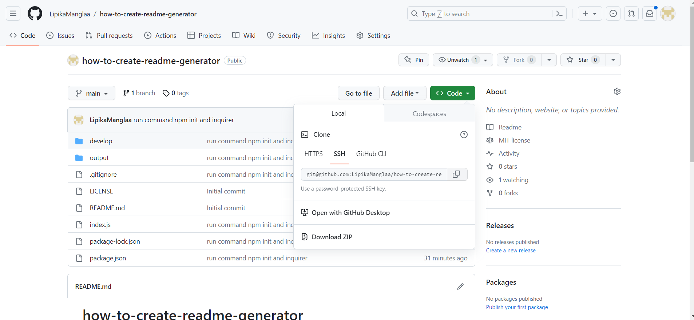
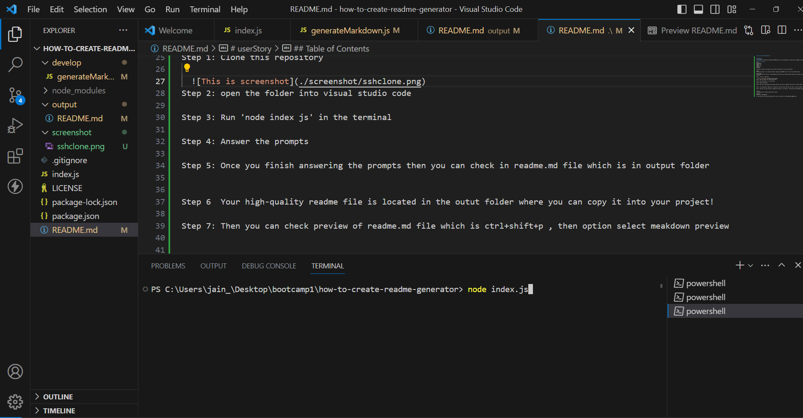
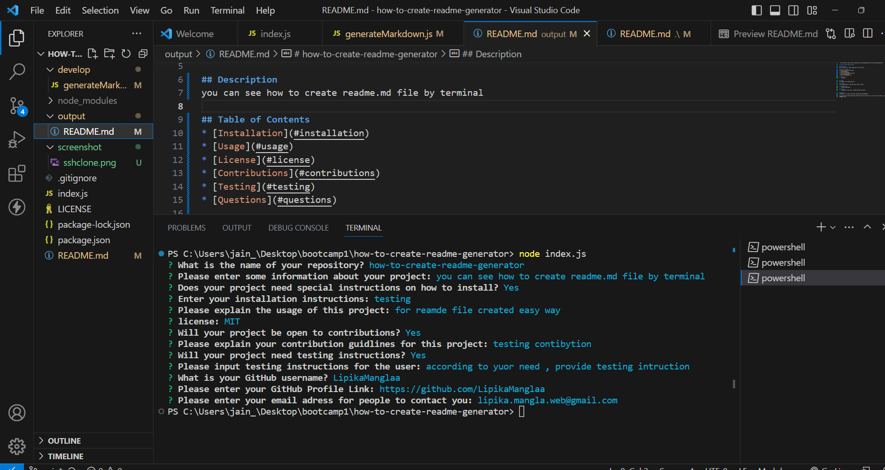
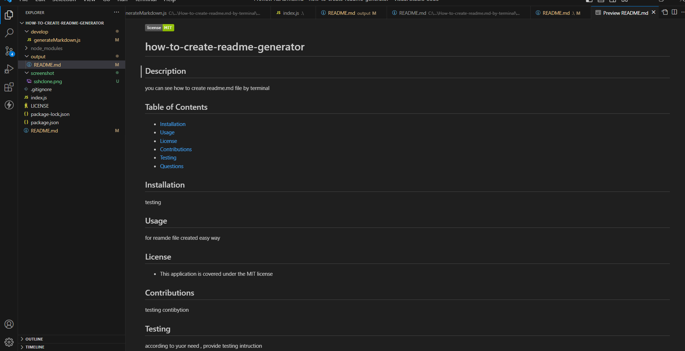
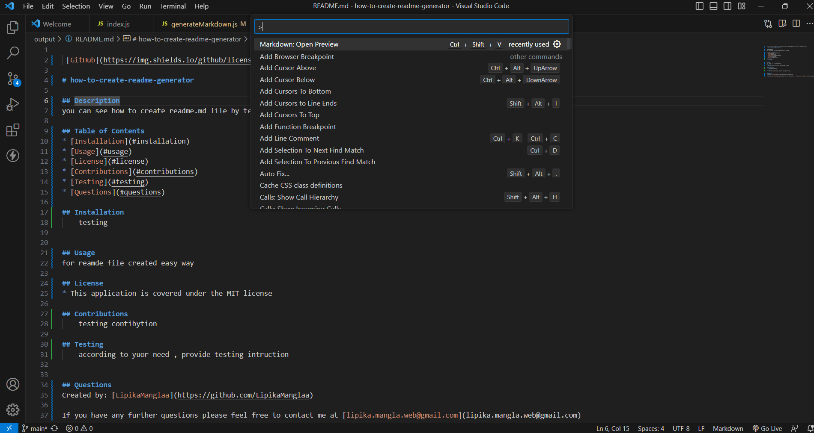
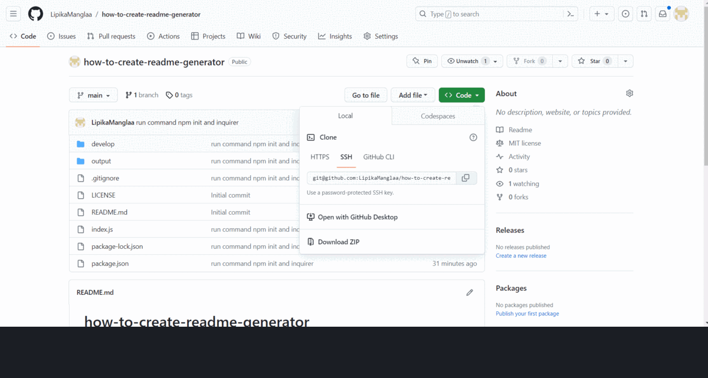

# how-to-create-readme-generator

# userStory
## description
This project will generate a high quality README.md file so that developer can create easily readme.md by terminal. i have used package of  [Inquirer package](https://www.npmjs.com/package/inquirer/v/8.2.4) for input form user.

## Table of Contents
Title
Description
Installation
Usage
Instructions
License
Questions

In order to install this project you must clone this project on to your local machine.

Usage
This project usage is for anyone that needs a high quality README.md file for their own GitHub Project!

Instructions
If you would like to see how to create readme.md file then you can check my github repo and let you know  how to cretae it

Step 1: Clone this repository

  
Step 2: open the folder into visual studio code

Step 3: Run 'node index js' in the terminal 

Step 4: Answer the prompts

Step 5: Once you finish answering the prompts then you can check in readme.md file which is in output folder

Step 6  Your high-quality readme file is located in the outut folder where you can copy it into your project!

Step 7: Then you can check preview of readme.md file which is ctrl+shift+p , then option select meakdown preview

License
This application is covered under the MIT license

## Demo

Questions
Created by: LipikaManglaa

If you have any further questions please feel free to contact me at lipika.mangla.web@gmail.com